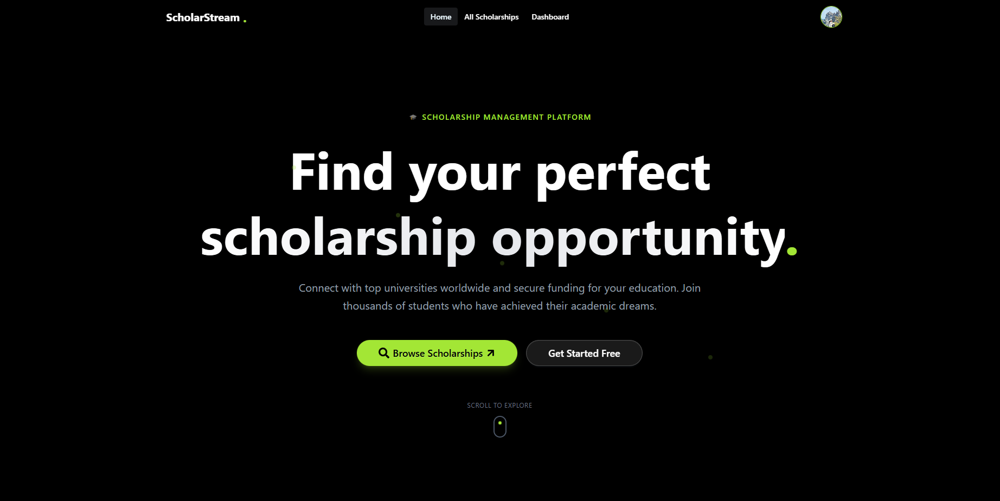

# ScholarStream Client (Frontend)

ScholarStream is a Scholarship Management Platform built to connect students with scholarship opportunities. This repository contains the **frontend (React/Vite)** application where students can browse scholarships, apply via Stripe payment, track applications, and write reviews. Admins and Moderators access dedicated dashboards for management and analytics.




---

## Purpose

The ScholarStream client provides:
- A modern UI for browsing and searching scholarships
- Secure authentication (Email/Password + Google login)
- Role-based dashboards (Student / Moderator / Admin)
- Stripe payment flow for scholarship applications
- Student reviews and moderator controls
- Admin analytics with charts and quick insights

---

## Live Links

- **Client (Vercel API):** https://scholarstream-client.vercel.app/
- **Client (Netlify API):** https://scholar-stream789.netlify.app/
- **Server (Vercel):** https://scholar-stream-server-sooty.vercel.app/
---

## Main Technologies Used

- **React**
- **Vite**
- **React Router DOM**
- **Firebase Authentication**
- **TanStack Query (React Query)**
- **Axios**
- **Stripe (React Stripe.js + Stripe.js)**
- **Recharts** (charts/graphs for Admin analytics)
- **Tailwind CSS** (and/or DaisyUI if used)
- **React Hot Toast**
- **Framer Motion** (Home page animations)

---

## Core Features

### Public Pages
- Home page with:
  - Banner / Hero section
  - Top scholarships (dynamic)
  - Framer Motion animations
  - Two additional sections (static)
- All Scholarships page:
  - Server-side search (Scholarship Name / University Name / Degree)
  - Filters (Category / Country / etc.)
  - Sorting (Fees / Post Date)
  - Pagination UI
- Scholarship Details:
  - Full scholarship details
  - Reviews section (reviewer image/name/date/rating/comment)
  - Apply button → redirects to payment (private)

### Authentication
- Register/Login with password validation
- Google social login
- Persistent login behavior on reload
- Protected/private routes for dashboard and checkout

### Payment System (Stripe)
- Checkout page (private)
- On success:
  - Application saved with `paymentStatus: "paid"`
  - Redirect to Payment Success page with receipt details
- On failure:
  - Application saved with `paymentStatus: "unpaid"`
  - Redirect to Payment Failed page (student can retry from dashboard)

### Dashboard (Role-Based Sidebar)
#### Student Dashboard
- My Applications:
  - View, edit (pending only), pay (pending + unpaid), delete (pending only)
  - Add review button (completed only)
- My Reviews:
  - View all personal reviews
  - Edit and delete review

#### Moderator Dashboard
- Manage Applications:
  - View all applications
  - Update status (Processing/Completed/Rejected)
  - Add feedback
  - View details in modal
- All Reviews:
  - View all reviews
  - Delete inappropriate reviews

#### Admin Dashboard
- Add Scholarship (form)
- Manage Scholarships (update/delete)
- Manage Users:
  - Filter by role
  - Promote/demote roles
  - Delete users
- Analytics:
  - Total users, scholarships, applications, revenue
  - Charts/graphs for quick visualization

### UX / UI Enhancements
- Loading spinners/skeletons on data fetching pages
- Error handling UI states
- Custom 404 page
- Responsive design for mobile/tablet/desktop

---

## NPM Packages / Dependencies Used

Common dependencies in this frontend include:
- `react`, `react-dom`
- `react-router-dom`
- `firebase`
- `@tanstack/react-query`
- `axios`
- `stripe` + `@stripe/stripe-js` + `@stripe/react-stripe-js`
- `recharts`
- `react-hot-toast`
- `framer-motion`
- `tailwindcss` (and possibly `daisyui`)

(If you paste your `package.json`, I can list the exact dependencies from your project.)

---

## Environment Variables

Create a `.env` file in the client root:

```env
VITE_API_URL=https://scholar-stream-server-sooty.vercel.app
VITE_STRIPE_PUBLIC_KEY=your_stripe_public_key

VITE_FIREBASE_API_KEY=your_firebase_api_key
VITE_FIREBASE_AUTH_DOMAIN=your_firebase_auth_domain
VITE_FIREBASE_PROJECT_ID=your_firebase_project_id
VITE_FIREBASE_STORAGE_BUCKET=your_firebase_storage_bucket
VITE_FIREBASE_MESSAGING_SENDER_ID=your_firebase_messaging_sender_id
VITE_FIREBASE_APP_ID=your_firebase_app_id
Important: Never commit .env to GitHub. Add it to .gitignore.

How to Run Locally
1) Clone the repository
bash
Copy code
git clone <your-client-repo-url>
cd <your-client-folder>
2) Install dependencies
bash
Copy code
npm install
3) Add environment variables
Create a .env file and fill in the values shown above.

4) Start the dev server
bash
Copy code
npm run dev
Client will run on:

http://localhost:5173

5) Build for production
bash
Copy code
npm run build
Deployment Notes
Vercel Deployment
Import the GitHub repository into Vercel

Add the environment variables in:

Vercel Project → Settings → Environment Variables

Redeploy after adding env vars

Firebase Authorized Domains
To avoid login issues in production:

Go to Firebase Console → Authentication → Settings → Authorized domains

Add your live domains:

scholarstream-client.vercel.app

(and/or Netlify domain if used)

Relevant Links
Client Live: https://scholarstream-client.vercel.app/

Client Live: https://scholar-stream789.netlify.app/

Server API Live: https://scholar-stream-server-sooty.vercel.app/


Project Summary:

ScholarStream streamlines scholarship discovery and application management:

Students can search, apply (paid/unpaid), and review scholarships

Moderators manage and review applications and content

Admins control the platform, users, scholarships, and analytics

